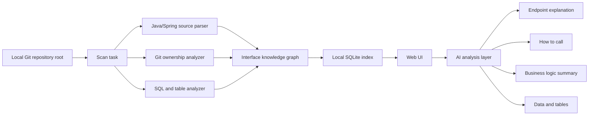

# Interface Overview Tool Design

## Goal

Build a local interface overview tool for Java/Spring Boot projects. The tool scans one local Git repository, builds a dedicated code knowledge graph, and provides a Web UI for finding APIs by Git author and inspecting what each API does, how it is called, what business logic it contains, which data it touches, and which database tables are involved.

The final implementation is a self-owned Java/Spring-specific scanning engine. CodeGraph is used only as a reference for local indexing, code search, symbol relationships, and knowledge graph ideas.

## First-Version Scope

The first version supports one local Git repository root as input. The directory must be a Git repository so the scanner can correlate source code with commit authors through Git history and blame data.

Supported project type:

- Java / Spring Boot backend projects.
- Spring MVC controllers and request mapping annotations.
- Service and Mapper style call chains.
- MyBatis XML SQL and basic table extraction.
- Basic JPA Entity and Repository clues where available.

Out of scope for the first version:

- Team login, permissions, and multi-user deployment.
- Multi-repository management.
- Frontend-to-backend flow tracing.
- Complete dynamic SQL interpretation.
- Full Spring Security or permission rule analysis.
- Incremental scanning.

## Product Shape

The tool runs locally:

1. Start a local service.
2. Open the Web UI in a browser.
3. Enter a local Git repository root path.
4. Run one scan.
5. Store scan results in a local SQLite database.
6. Browse authors, endpoints, call chains, related SQL, tables, and AI-generated endpoint summaries.

The UI reads the scan database through the local backend API. It does not rescan source files on every page interaction.

## Architecture



The core principle is: scan once, build a local knowledge base, and make the UI query that knowledge base.

## Recommended Technology Stack

- Backend and scanner: Java + Spring Boot.
- Java parsing: JavaParser in the first version; tree-sitter can be considered later if multi-language support becomes important.
- Git analysis: local `git` commands for reliable blame/log behavior; JGit may be added where it improves portability.
- Database: SQLite.
- SQL parsing: rule-based extraction in the first version; JSqlParser later for stronger SQL support.
- Frontend: React + Vite + TypeScript.
- Graph visualization: React Flow.
- Tables and filters: TanStack Table.
- AI integration: OpenAI-compatible API.

This stack keeps the scanner close to Spring Boot semantics while giving the UI enough flexibility for dense engineering workflows.

## Data Model

### repositories

- `id`
- `root_path`
- `repo_name`
- `current_branch`
- `head_commit`
- `has_uncommitted_changes`
- `scanned_at`

### git_authors

- `id`
- `name`
- `email`
- `commit_count`

### source_files

- `id`
- `repo_id`
- `path`
- `language`
- `file_hash`
- `last_commit`
- `primary_author_id`

### api_endpoints

- `id`
- `repo_id`
- `controller_file_id`
- `class_name`
- `method_name`
- `http_method`
- `path`
- `request_params_json`
- `request_body_type`
- `response_type`
- `line_start`
- `line_end`
- `primary_author_id`

### code_symbols

- `id`
- `repo_id`
- `file_id`
- `symbol_type`
- `class_name`
- `method_name`
- `signature`
- `line_start`
- `line_end`
- `primary_author_id`

### call_edges

- `id`
- `from_symbol_id`
- `to_symbol_id`
- `confidence`
- `evidence`

### db_tables

- `id`
- `repo_id`
- `table_name`
- `source_type`

### sql_fragments

- `id`
- `repo_id`
- `file_id`
- `mapper_namespace`
- `mapper_method`
- `sql_text`
- `tables_json`
- `operation_type`

### endpoint_related_tables

- `endpoint_id`
- `table_id`
- `relation_type`
- `confidence`

### ai_endpoint_summaries

- `endpoint_id`
- `model`
- `summary_json`
- `generated_at`

## Ownership Model

Author ownership is not only file-level ownership. The scanner calculates it at three levels:

- File primary author: based on `git log --follow -- <file>`.
- Method primary author: based on `git blame` over the method line range.
- Endpoint ownership: based on the Controller method plus downstream Service and Mapper method ownership.

The UI should show weighted authorship, for example:

```text
Endpoint: POST /order/create
Main author: Zhang San 72%
Related authors: Li Si 18%, Wang Wu 10%
Tables: order_main, order_item, user_account
```

This makes "who contributed to this API" more accurate than simply using the last file committer.

## Scan Pipeline

### 1. Repository Validation

The scanner receives a local Git repository root path. It verifies:

- The path exists.
- The path contains `.git`.
- The current branch can be resolved.
- HEAD commit can be resolved.
- Whether the worktree contains uncommitted changes.

Uncommitted changes do not block scanning, but the scan record must mark that the result includes worktree changes.

### 2. File Discovery

Include:

```text
src/main/java/**/*.java
src/main/resources/**/*.xml
src/main/resources/**/*.yml
src/main/resources/**/*.properties
```

Exclude:

```text
target
build
.idea
.gradle
node_modules
```

### 3. Java AST Parsing

Parse Java classes, methods, annotations, fields, imports, method bodies, and line ranges.

First-version annotation support:

```text
@RestController
@Controller
@RequestMapping
@GetMapping
@PostMapping
@PutMapping
@DeleteMapping
@Autowired
@Resource
constructor injection
```

### 4. Endpoint Extraction

Controller class-level and method-level mappings are combined into final endpoints:

```text
class @RequestMapping("/api/order")
method @PostMapping("/create")
=> POST /api/order/create
```

The scanner records:

- HTTP method.
- Full path.
- Controller class and method.
- Request parameters.
- Request body type.
- Response type.
- Source file and line range.

### 5. Call Chain Construction

The first version builds deterministic call chains:

```java
orderService.createOrder(req)
orderMapper.insert(order)
```

It resolves common Spring injection patterns:

- Field injection.
- `@Resource` by name/type where possible.
- Constructor injection.

Reflection, dynamic beans, complicated generics, and indirect event flows are skipped or recorded as low-confidence evidence.

Every call edge has:

- Source symbol.
- Target symbol.
- Confidence.
- Evidence string.

### 6. Database Table Extraction

MyBatis is the first priority:

- Parse Mapper XML files.
- Match `namespace + id` to Mapper interface methods.
- Extract SQL text from `select`, `insert`, `update`, and `delete`.
- Extract table names from `from`, `join`, `insert into`, `update`, and `delete from`.

JPA support is secondary in the first version:

- Detect `@Entity`.
- Detect `@Table(name = "...")`.
- Detect Repository generic entity types such as `JpaRepository<UserEntity, Long>`.

Every endpoint-table relation has a confidence value.

### 7. Git Ownership Analysis

For each file, method, and endpoint-related method range, run Git analysis:

```text
git blame -L start,end -- file
git log --follow -- file
```

The scanner stores:

- File primary author.
- Method primary author.
- Endpoint author ratio.
- Downstream call chain author ratio.

### 8. AI Context Generation

For each endpoint, generate a structured evidence package:

```json
{
  "endpoint": {
    "method": "POST",
    "path": "/order/create",
    "controller": "OrderController.createOrder",
    "file": "src/main/java/.../OrderController.java",
    "lines": [42, 86]
  },
  "request": {
    "params": [],
    "body_type": "CreateOrderRequest",
    "response_type": "ApiResult<OrderVO>"
  },
  "call_chain": [
    {
      "symbol": "OrderService.createOrder",
      "snippet": "...",
      "author": "Zhang San",
      "confidence": 0.92
    }
  ],
  "tables": [
    {
      "name": "order_main",
      "operation": "insert",
      "evidence": "OrderMapper.xml#insertOrder"
    }
  ],
  "git_authors": [
    {"name": "Zhang San", "ratio": 0.72},
    {"name": "Li Si", "ratio": 0.18}
  ]
}
```

The AI sees only this package, not the whole repository.

## AI Output Contract

AI output is cached as JSON:

```json
{
  "title": "Create order endpoint",
  "what_it_does": "Creates order master and item records.",
  "how_to_call": {
    "method": "POST",
    "path": "/order/create",
    "body": "CreateOrderRequest",
    "response": "ApiResult<OrderVO>"
  },
  "business_logic": [
    "Validate user status",
    "Create order master record",
    "Batch insert order item records",
    "Return order number"
  ],
  "data_touched": [
    {
      "table": "order_main",
      "operation": "insert",
      "reason": "Stores the order master record"
    }
  ],
  "authors": [
    {
      "name": "Zhang San",
      "role": "Main implementer",
      "evidence": "Controller, Service, and Mapper lines are mostly attributed to this author"
    }
  ],
  "uncertainties": [
    "No external payment call was identified in the scanned call chain"
  ]
}
```

Prompt rules:

- The AI is a Java/Spring Boot endpoint analysis assistant.
- It may only use the provided endpoint, call chain, SQL, table, and Git author evidence.
- It must not invent external systems, permission rules, or business meaning.
- If evidence is insufficient, it must write the issue into `uncertainties`.
- Output must be valid JSON.

## UI Design

The first version is a local engineering workbench with three columns:

```text
+----------------+----------------------+----------------------------+
| Authors/filter | Endpoint list        | Endpoint detail            |
+----------------+----------------------+----------------------------+
| Zhang San      | POST /order/create   | Basic information          |
| Li Si          | GET /order/{id}      | Call chain                 |
| Wang Wu        | PUT /order/status    | AI business summary        |
|                |                      | Params and response        |
| Module filter  |                      | SQL and tables             |
| Table filter   |                      | Related commits/authors    |
+----------------+----------------------+----------------------------+
```

Main workflows:

1. Enter a local Git repository root and start scanning.
2. Watch scan progress by phase: files, endpoints, call chains, SQL, Git blame, AI analysis.
3. Select an author on the left.
4. See related endpoints in the middle.
5. Select an endpoint and inspect details on the right.
6. Search by path, class name, method name, table name, author, or HTTP method.
7. Export a Markdown report for one author or one endpoint.

The UI style should be dense, calm, and tool-like. It should behave like a code review and analysis workbench rather than a marketing dashboard.

## MVP Feature List

First version:

- Input one local Git repository root.
- Run one full scan.
- Store scan output in SQLite.
- Detect Spring Controller endpoints.
- Extract HTTP method, path, request type, response type, and line range.
- Build deterministic Controller -> Service -> Mapper call chains.
- Parse MyBatis XML and extract basic table names.
- Calculate method and endpoint author ratios through Git blame.
- Filter endpoints by Git author.
- Show endpoint detail with call chain, SQL, tables, author ratios, and AI summary.
- Export Markdown reports.

Second version:

- Stronger JPA Repository and Entity relationship support.
- More complete dynamic SQL support.
- MyBatis Provider and Wrapper query support.
- Spring Security, Sa-Token, and Shiro permission recognition.
- Cross-module Maven/Gradle project support.
- Frontend-to-backend route tracing.
- Multiple repositories and scan history.
- Incremental scanning.
- Team-shared service deployment.

## Accuracy Principle

The first version should prefer precision over broad but unreliable inference:

- If a relationship is clear, store it as high confidence.
- If a relationship is inferred but uncertain, store it as low confidence.
- If a relationship cannot be supported by source evidence, do not invent it.
- The UI must expose low-confidence relationships as "needs confirmation".

This keeps the tool useful for engineering review instead of becoming a vague AI summary surface.

