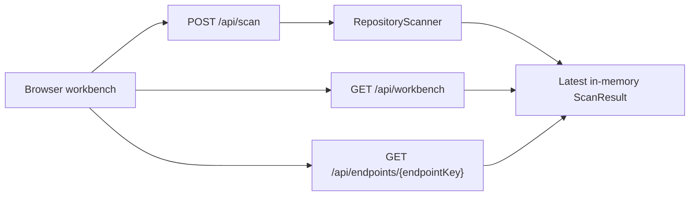

# Phase Two UI MVP Design

## Goal

Build the first usable Web workbench for springApiLens. A user should be able to start the local Spring Boot app, open a browser, scan one local Git repository, browse discovered Spring endpoints, filter them, and inspect the available evidence for one endpoint.

This phase is intentionally a product-shaped MVP, not the final knowledge graph product. It turns the phase-one scanner into something visible and usable while keeping the implementation small enough to verify.

## Scope

Phase two includes:

- A local Web UI served by the Spring Boot app.
- A scan form for `repoPath` and optional `snapshotPath`.
- A scan result summary with repository name and counts.
- An endpoint list with search and HTTP method filters.
- An endpoint detail panel showing controller information, request/response types, file lines, call edges, SQL fragments, tables, and available author evidence.
- Backend API responses that expose the latest in-memory scan result in a UI-friendly shape.
- Focused tests for the new API response behavior.

Phase two does not include:

- AI-generated endpoint summaries.
- React/Vite dependency setup.
- SQLite persistence.
- Incremental scanning.
- Real graph visualization with React Flow.
- Multi-repository scan history.
- Authentication or shared server deployment.

Those are planned later. The MVP should prefer clarity and working local usage over broad architecture.

## Product Experience

The first screen is the actual workbench, not a landing page. It has a compact top scan bar and a three-panel workspace:

```text
+--------------------------------------------------------------------------------+
| Repo path input                         Snapshot path input       Scan button    |
+----------------------+------------------------------+--------------------------+
| Filters              | Endpoint list                | Endpoint detail          |
| - search             | POST /api/order/create       | Basic info              |
| - HTTP method        | GET /api/order/{id}          | Request / response      |
| - table keyword      |                              | Call evidence           |
| - author keyword     |                              | SQL and tables          |
+----------------------+------------------------------+--------------------------+
```

The UI style should be dense, calm, and engineering-focused. It should feel like a code review tool, not a marketing dashboard. Empty states should be direct: no scanned endpoints yet, scan failed, no endpoint selected, or no SQL evidence found.

## Architecture

The backend remains the source of truth. The browser talks to Spring Boot APIs, and Spring Boot keeps the latest `ScanResult` in memory.

For this phase, the frontend is plain static HTML/CSS/JavaScript under `spring-api-lens-app/src/main/resources/static`. This avoids introducing Node dependency setup before the product workflow is proven. The static app can be replaced by React/Vite later without changing the backend contract if the API response shapes stay stable.



## Backend API

### POST /api/scan

Keep the existing scan endpoint and continue returning:

```json
{
  "repoName": "demo-springboot",
  "endpointCount": 4,
  "callEdgeCount": 12,
  "sqlFragmentCount": 8
}
```

When a scan succeeds, store the entire latest `ScanResult` in memory, not only endpoint records.

### GET /api/workbench

Returns a compact payload for the main UI:

```json
{
  "repository": {
    "repoName": "demo-springboot",
    "rootPath": "D:\\workspace\\demo-springboot",
    "branchName": "main",
    "headCommit": "abc123",
    "hasUncommittedChanges": false
  },
  "summary": {
    "endpointCount": 4,
    "callEdgeCount": 12,
    "sqlFragmentCount": 8,
    "tableCount": 5
  },
  "endpoints": [
    {
      "key": "OrderController#create|POST|/api/order/create",
      "httpMethod": "POST",
      "path": "/api/order/create",
      "className": "OrderController",
      "methodName": "create",
      "requestBodyType": "CreateOrderRequest",
      "responseType": "ApiResult<OrderVO>",
      "relativeFile": "src/main/java/.../OrderController.java",
      "lineStart": 42,
      "lineEnd": 86,
      "tables": ["order_main", "order_item"],
      "callCount": 3
    }
  ],
  "filters": {
    "httpMethods": ["GET", "POST"],
    "tables": ["order_main", "order_item"],
    "authors": []
  }
}
```

The author list can be empty in this phase if endpoint-level contribution ratios are not yet connected to the UI payload. The UI must still include an author keyword filter placeholder so the workflow has a stable place to grow.

### GET /api/endpoints/{endpointKey}

Returns detail evidence for the selected endpoint:

```json
{
  "endpoint": {
    "key": "OrderController#create|POST|/api/order/create",
    "httpMethod": "POST",
    "path": "/api/order/create",
    "className": "OrderController",
    "methodName": "create",
    "requestParamsJson": "[]",
    "requestBodyType": "CreateOrderRequest",
    "responseType": "ApiResult<OrderVO>",
    "relativeFile": "src/main/java/.../OrderController.java",
    "lineStart": 42,
    "lineEnd": 86
  },
  "callEdges": [
    {
      "fromSignature": "OrderController.create(CreateOrderRequest)",
      "toSignature": "OrderService.create(CreateOrderRequest)",
      "confidence": 0.8,
      "evidence": "orderService.create(request)"
    }
  ],
  "sqlFragments": [
    {
      "relativeFile": "src/main/resources/mapper/OrderMapper.xml",
      "mapperNamespace": "com.demo.OrderMapper",
      "mapperMethod": "insertOrder",
      "operationType": "insert",
      "tables": ["order_main"],
      "sqlText": "insert into order_main ..."
    }
  ],
  "tables": ["order_main", "order_item"],
  "authors": []
}
```

For this phase, endpoint-to-SQL association can be conservative:

- Include SQL fragments whose mapper method or namespace appears in deterministic call evidence.
- If no confident association exists, show no SQL fragments instead of showing unrelated SQL.
- The workbench summary can still expose all discovered table names globally.

## Frontend Behavior

### Scan Bar

The scan bar contains:

- Repo path text input.
- Snapshot path text input.
- Scan button.
- Inline status text.

During scanning, disable the button and show a running state. On success, refresh `GET /api/workbench`. On failure, show the backend error message in the status area.

### Endpoint List

The middle panel lists endpoints with:

- HTTP method badge.
- Path.
- Controller method.
- Request body and response type.
- Table chips when available.

Filters run client-side against the latest workbench payload:

- Search path, controller class, method name, request type, response type.
- HTTP method.
- Table keyword.
- Author keyword placeholder.

### Endpoint Detail

Selecting an endpoint calls `GET /api/endpoints/{endpointKey}` and fills the right panel:

- Basic information.
- Request and response.
- Source file and line range.
- Call evidence list.
- SQL fragments and tables.
- Authors placeholder.

If a section has no evidence, show a compact empty state rather than hiding the section. That makes scanner limitations visible.

## Error Handling

Backend validation errors should produce clear HTTP 400 responses for invalid repository paths. Unexpected scan failures should produce HTTP 500 responses with a safe message.

Frontend errors should not break the page. The UI should preserve the last successful workbench result when a later scan fails.

## Testing

Backend tests should cover:

- `POST /api/scan` stores the full latest result.
- `GET /api/workbench` returns repository, summary, endpoints, and filter values.
- `GET /api/endpoints/{endpointKey}` returns detail evidence for a known endpoint.
- Unknown endpoint keys return HTTP 404.

Frontend verification should cover:

- The static UI loads from `/`.
- A scan request can be submitted from the browser.
- The endpoint list renders after a scan.
- Selecting an endpoint renders the detail panel.

Because the frontend is static JavaScript in this phase, browser verification is sufficient for UI behavior after backend tests pass.

## Acceptance Criteria

The phase is complete when:

1. `mvn test` passes.
2. Starting the Spring Boot app serves the workbench at `http://localhost:8080/`.
3. Entering a local Git repository path and scanning displays endpoint rows.
4. Selecting an endpoint displays controller, request/response, call edge, SQL/table, and author placeholder sections.
5. The feature branch is committed and pushed.

## Future Migration Path

Once the MVP workflow feels right, replace the static frontend with React/Vite and introduce richer components:

- TanStack Table for endpoint browsing.
- React Flow for call graph visualization.
- A persisted SQLite scan index.
- AI endpoint summary generation and caching.

The API shapes from this phase should remain close to those future needs so the UI migration does not force a backend rewrite.
